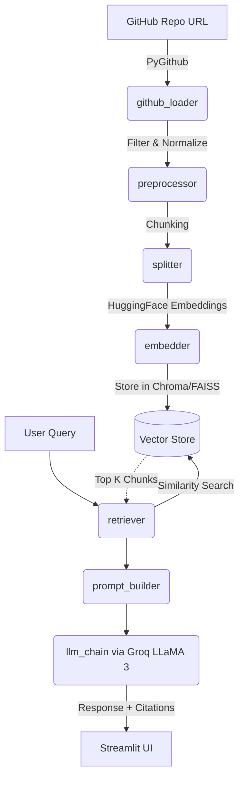

# Architecture

## Data Flow

```mermaid
graph TD
    A[GitHub Repo URL] -->|PyGithub| B(github_loader)
    B -->|Filter & Normalize| C(preprocessor)
    C -->|Chunking| D(splitter)
    D -->|HuggingFace Embeddings| E(embedder)
    E -->|Store in Chroma/FAISS| F[(Vector Store)]

    U[User Query] --> G(retriever)
    G -->|Similarity Search| F
    F -.->|Top K Chunks| G
    G --> H(prompt_builder)
    H --> I(llm_chain via Groq LLaMA 3)
    I -->|Response + Citations| J[Streamlit UI]
```

## Key Technologies
- **Ingestion**: LangChain Core, PyGithub
- **Vector DB**: ChromaDB, FAISS
- **LLM**: Groq (LLaMA 3)
- **Memory**: MongoDB
- **UI**: Streamlit
